# Analisis-Datos

Visualización de Datos a través de varios DashBoards Interactivos utilizando diferentes herramientas como Power Bi o Tableau. 

Los datasets para cada análisis se encuentran en la carpeta del propio análisis.

# Análisis La Liga Santander 2021-2022
Con este análisis, se busca proporcionar información a aficionados o incluso a estos propios clubes, sobre el rendimiento
de los equipos y de sus jugadores, mostrando minutos jugados, goles anotados, porcentaje de duelos ganados,
qué equipos son más fuertes jugando como locales...

A continuación veamos algunos ejemplos de los apartados que veremos en el DashBoard:
Para comenzar, se muestra una tabla, donde se visualiza la clasificación general por equipos de la La Liga Santander
en la temporada 2021-2022. Además, se muestran tarjetas donde se muestra información sobre el total de goles anotados
durante la temporada, total de tarjetas, de jugadores y un gráfico circular que muestra los porcentajes de jugadores
por cada posición.

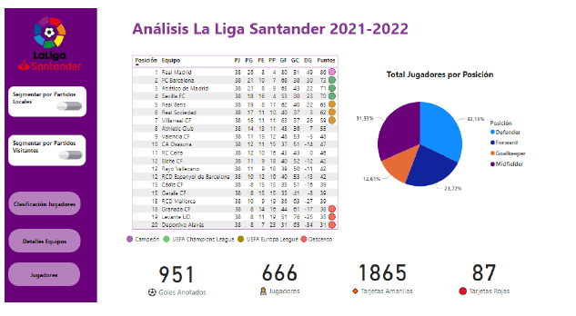

En esta siguiente página se muestran los mejores jugadores en base a algunas estadísticas como los goles, asistencias
y paradas realizadas

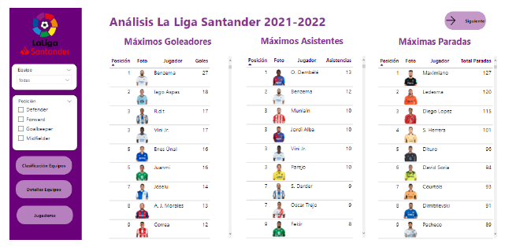

Si se mantiene el ratón sobre algún jugador de la tabla de máximos goleadores, se muestra información sobre
más estadísticas del jugador, como el número de tiros realizados, las posiciones desde donde ha marcado los goles, el
promedio goleador o cada cuantos minutos anota un gol.

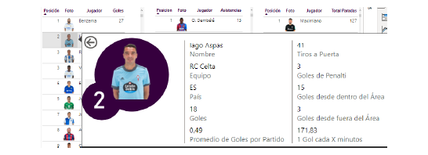

En la siguiente página, se podrá elegir al equipo del que se quiere obtener información. El usuario dispondrá de una
tabla con las estadísticas más importantes, y con las que se ha estado trabajando anteriormente. También dispondrá
de tarjetas con información sobre las estadísticas globales del equipo (resaltar que la tarjeta de goles anotados puede
no coincidir con los goles totales del equipo, debido a que sólo se tienen en cuenta los goles anotados por jugadores
del equipo y no los goles anotados en propia puerta).

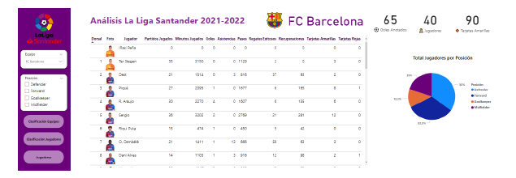

Si se pasa el ratón por encima de un jugador, se mostrará toda información del jugador más detallada como por
ejemplo un gráfico representando el porcentaje de duelos ganados y otro gráfico representando el porcentaje de minutos
disputados.

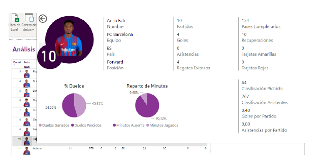

Por último, se diseña una página de búsqueda por jugador para poder permitir obtener las estadísticas del jugador
simplemente buscándolo por su nombre futbolístico.

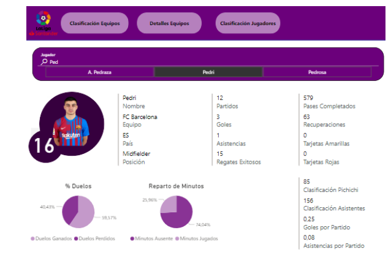

# Análisis F1 Season 2022

Con este análisis, se busca proporcionar información a aficionados o incluso a estos propios equipos, sobre el
rendimiento de los equipos y de sus pilotos, mostrando las clasificaciones del mundial de pilotos y del mundial de
constructores, mejor posición final en todo el año, número de carreras abandonadas, número de vueltas recorridas...

Para comenzar, se muestra una tabla, donde se pueden ver en las filas los pilotos y en las columnas todas las
carreras, en la celda, se muestra la posición en la que acabó en dicha carrera.
En las celdas, también se aprecia un círculo coloreado al lado de la posición, que representa pues el puesto del podio que
ocupa (si está en el podio), si está en las posiciones que otorgan puntos o no (los 10 primeros clasificados suman puntos).

A continuación, en la parte inferior del DashBoard se representan las clasificaciones referentes al mundial de pilotos
y al mundial de constructores, ordenadas lógicamente por las mayores puntuaciones. Las puntuaciones se ven coloreadas
en función del número de puntos, siguiendo la paleta de colores que se puede apreciar en la esquina superior derecha
del DashBoard.

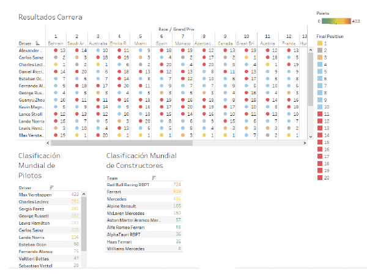

Datos que pueden ser interesantes es estudiar la evolución en el campeonato de los pilotos. La F1 es un deporte en
el que el coche juega un papel determinante en los resultados, por eso, habitualmente, la comparación que se realiza normalmente es entre compañeros de equipo, ya que conducen practicamente el mismo monoplaza.

En este DashBoard, se presentan dos gráficos de líneas, el primero muestra la evolución de la posición final de los
pilotos a lo largo de las carreras, mientras que el segundo, muestra la trayectoria en cuanto puntos conseguidos a lo
largo de la temporada.
Lo interesante de estos gráficos, es comparar a varios pilotos, por lo que se tienen dos elementos de filtro, con los que
se pueden elegir los pilotos a estudiar, o también se pueden elegir las escuderías que analizar (en este caso se muestra
la trayectoria de ambos pilotos de la escudería).

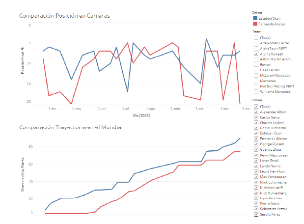

El mundial de F1 recorre el mundo durante los 8 meses que dura la competición. En ellos corren en países desde
Australia y Japón a México y Brasil. Por ello, se ha decidido representar en dos mapas, quién ha ganado en cada
circuito y quien ha hecho la pole (quedar primero en clasificación). Como se ve en la siguiente imagen, en cada ciudad
en la que se celebró un Gran Premio se muestra un círculo coloreado con el color representativo del equipo que ganó
la carrera, o en el caso del segundo mapa el equipo que consiguió la pole.

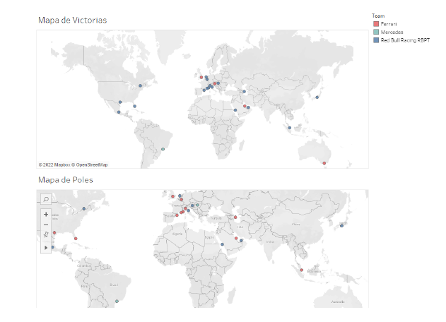

En el siguiente DashBoard se van a representar varios gráficos de diferente tipo. Vamos a comenzar con el gráfico
situado en la parte superior, que es un gráfico de barras, en el que se realiza una comparación para cada piloto del
número de veces que partió desde la primera posición con las veces en las que cruzó la línea de meta como ganador. Si
nos fijamos en la leyenda, se aprecia como la barra azul representa el número de poles mientras que la roja representa el número de victorias.

A simple vista llama bastante la atención los números de Leclerc comparados con los de Verstappen, y es que el monegasco,
sale más veces desde la primera posición, pero el piloto de RedBull sin embargo consigue un mayor número
de victorias.

Por otro lado, en la parte inferior del gráfico, se ven varias tablas, donde los datos están subrayados por colores
con una tonalidad más fuerte en función del valor a estudiar (vueltas, abandonos o participaciones en la Q3).
El primer gráfico representa el número de veces en los que el piloto ha conseguido llegar a la tercera ronda de clasificación
(Q3), por lo que simplemente para representar esta tabla se ha realizado un recuento de los tiempos que los pilotos
tengan de esta ronda, es decir, si tienen un tiempo marcado han participado, mientras que si no lo tienen, no han
participado.

Algo destacado a comentar, es que para la tabla del número de abandonos por piloto, se ha creado un campo calculado
denominado ”Abandonos” el cual comprueba el valor de la columna ”Time/Retired”, y si el valor es ”DNF” se suma 1
al número de abandonos.

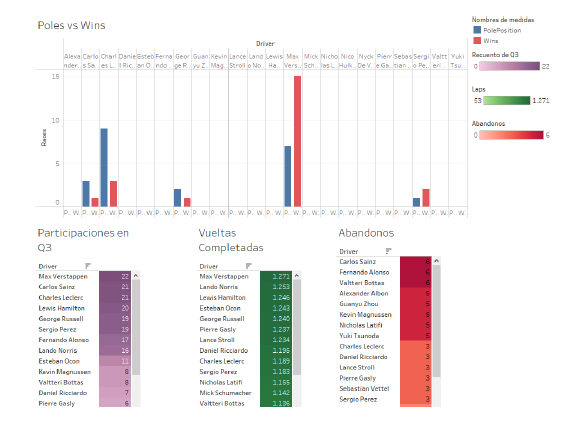

En el DashBoard que se puede ver a continuación, se tienen dos tablas en las que se muestran los resultados de los
pilotos en cada circuito. En las celdas de la tablas, se han utilizado iconos para representar si el piloto ha abandonado
la carrera o por otro lado si bien ha acabado en los puntos.
Para poder realizar estas representaciones se han creado dos campos calculados. El primero, denominado ”DNF”, sirve
para saber si el piloto se ha retirado comprobando la columna ”Time/Retired” que se ha visto en el caso anterior. El
otro campo calculado se denomina ”Puntuando” y comprueba en la columna ”Final Position” si el valor es mayor que
11.

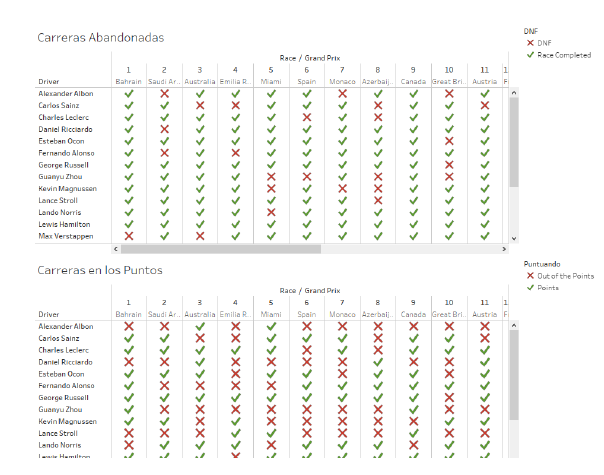

